# open-congress-data

Open data for the Philippine Congress: track representatives, senators, bills,
and voting records. Transparent and community-maintained.

## Data Sources

This project aggregates publicly available information from official Philippine
government sources:

- **Senate of the Philippines**: https://web.senate.gov.ph
- **House of Representatives**: https://congress.gov.ph
- **Legislative Documents and Records**: https://ldr.senate.gov.ph
- **eCongress**: https://econgress.gov.ph

## Data Structure

All data files are organized in the `data/` directory with subdirectories for each entity type:
- `data/congress/` - Philippine Congress entities (8th through 20th)
- `data/committee/` - Senate committee entities
- `data/person/` - Senator and official entities

The following graph shows the current entities and their relationships in the
dataset:

```mermaid
graph LR
    %% Node definitions with styling
    Congress["🏛️ Congress<br/>━━━━━━━<br/>• id<br/>• congress_number<br/>• congress_website_key<br/>• name<br/>• ordinal<br/>• year_range<br/>• start_date<br/>• end_date"]

    Committee["📋 Committee<br/>━━━━━━━<br/>• id<br/>• name<br/>• type<br/>• senate_website_keys[]"]

    Person["👤 Person<br/>━━━━━━━<br/>• id<br/>• full_name<br/>• first_name<br/>• last_name<br/>• middle_initial<br/>• senate_website_keys[]<br/>• aliases[]"]

    %% Relationships
    Committee -->|BELONGS_TO| Congress
    Person -->|SERVED_IN| Congress

    %% Styling
    classDef congressNode fill:#4a90e2,stroke:#2c5aa0,stroke-width:2px,color:#fff
    classDef committeeNode fill:#7cb342,stroke:#558b2f,stroke-width:2px,color:#fff
    classDef personNode fill:#ff7043,stroke:#d84315,stroke-width:2px,color:#fff

    class Congress congressNode
    class Committee committeeNode
    class Person personNode
```

### Entity Details

- **Congress**: Central entity representing each Philippine Congress (8th
  through 20th)
- **Committee**: Senate committees that operate within specific congresses
- **Person**: Senators and officials who serve in various congresses

Relationships to Congress nodes are established through the BELONGS_TO (for
Committees) and SERVED_IN (for People) edges, based on the `congresses` field in
the source TOML files.

## Impostor Syndrome Disclaimer

**We want your help. No, really.**

There may be a little voice inside your head that is telling you that you're not
ready to be an open source contributor; that your skills aren't nearly good
enough to contribute. What could you possibly offer a project like this one?

We assure you - the little voice in your head is wrong. If you can write code at
all, you can contribute code to open source. Contributing to open source
projects is a fantastic way to advance one's coding skills. Writing perfect code
isn't the measure of a good developer (that would disqualify all of us!); it's
trying to create something, making mistakes, and learning from those mistakes.
That's how we all improve, and we are happy to help others learn.

Being an open source contributor doesn't just mean writing code, either. You can
help out by writing documentation, tests, or even giving feedback about the
project (and yes - that includes giving feedback about the contribution
process). Some of these contributions may be the most valuable to the project as
a whole, because you're coming to the project with fresh eyes, so you can see
the errors and assumptions that seasoned contributors have glossed over.

**Remember:**

- No contribution is too small
- Everyone started somewhere
- Questions are welcome
- Mistakes are learning opportunities
- Your perspective is valuable

(Impostor syndrome disclaimer adapted from
[Adrienne Friend](https://github.com/adriennefriend/imposter-syndrome-disclaimer))

## License

This repository is dedicated to the public domain under **CC0 1.0 Universal (CC0
1.0) Public Domain Dedication**.

You can copy, modify, distribute and perform the work, even for commercial
purposes, all without asking permission.

- No Copyright
- No Rights Reserved
- No Attribution Required

For more information, see the
[CC0 1.0 Universal license](https://creativecommons.org/publicdomain/zero/1.0/).
